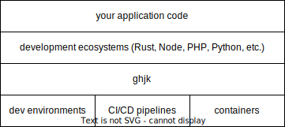

# ghjk

ghjk /gk/ is a set of tools for managing developer environments and an attempt at a successor for [asdf](https://github.com/asdf-vm/asdf).

> ghjk is part of the
> [Metatype ecosystem](https://github.com/metatypedev/metatype). Consider
> checking out how this component integrates with the whole ecosystem and browse
> the
> [documentation](https://metatype.dev?utm_source=github&utm_medium=readme&utm_campaign=ghjk)
> to see more examples.

## Introduction

ghjk offers a unified abstraction to manage package managers (e.g. cargo, pnpm, poetry), languages runtimes (e.g. nightly rust, node@18, python@latest) and developer tools (e.g. pre-commit, eslint, protoc). 
It enables you to define a consistent environment across your dev environments, CI/CD pipelines and containers keeping everything well-defined in your repo and providing a great DX. 
This makes it especially convenient for mono-repos and long-lived projects. See [Metatype](https://github.com/metatypedev/metatype) and its [ghjkfile](https://github.com/metatypedev/metatype/blob/main/ghjk.ts) for a real world example.

<p align="center">
  
</p>

## Features

- Install standalone posix programs or those found on different backends and registries 
  - [npm](./ports/npmi.ts)
  - [pypi](./ports/pipi.ts)
  - [crates.io](./ports/cargobi.ts)
  - [TBD] [Github releases](https://github.com/metatypedev/ghjk/issues/79)
- Tasks written in typescript
  - Ergonomically powered by [`dax`](https://github.com/dsherret/dax).
  - Built on Deno, most dependencies are [an import away](https://docs.deno.com/runtime/fundamentals/modules/#importing-third-party-modules-and-libraries).
- Soft-reproducible posix environments.
  - Declaratively compose envs for developer shells, CI and tasks.
  - Run tasks when entering/exiting envs.

## Getting started

Before anything, make sure the following programs are available on the system.

- git
- tar (preferably GNU tar)
- curl
- unzip
- zstd

Install the ghjk cli using the installer scripts like so:

```bash
curl -fsSL "https://raw.github.com/metatypedev/ghjk/v0.3.0-rc.2/install.sh" | bash
```

Use the following command to create a starter `ghjk.ts` in your project directory:

```bash
ghjk init ts
```

### Environments

Ghjk is primarily configured through constructs called "environments" or "envs" for short.
They serve as recipes for making (mostly) reproducible posix shells.

```ts
// NOTE: `ghjk.ts` files are expected to export this sophon object
export { sophon } from "ghjk";
import { file } from "ghjk";
// ports are small programs that install sowtware to your envs
import * as ports from "ghjk/ports/mod.ts";

const ghjk = file({});

// top level `install`s go to the `main` env
ghjk.install(ports.protoc());
ghjk.install(ports.rust());

// the previous block is equivalent to
ghjk.env("main", {
  installs: [ports.protoc(), ports.rust()],
});

ghjk
  .env("dev", {
    // by default, all envs are additively based on `main`
    // pass false here to make env independent.
    // or pass name(s) of another env to base on top of
    inherit: false,
    // envs can specify posix env vars
    vars: { CARGO_TARGET_DIR: "my_target" },
    installs: [ports.cargobi({ crateName: "cargo-insta" }), ports.act()],
  })
  // use env hooks to run code on activation/deactivation
  .onEnter(ghjk.task(($) => $`echo dev activated`))
  .onExit(ghjk.task(($) => $`echo dev de-activated`));

ghjk.env({
  name: "docker",
  desc: "for Dockerfile usage",
  // NOTE: env references are order-independent
  inherit: "ci",
  installs: [ports.cargobi({ crateName: "cargo-chef" }), ports.zstd()],
});

// builder syntax is also available
ghjk.env("ci")
  .var("CI", "1")
  .install(ports.opentofu_ghrel());

// tasks, invokable using CLI commands
// each one describes it's own env as well
ghjk.task({
  name: "run",
  inherit: "dev",
  fn: () => console.log("online"),
});

ghjk.config({
  defaultBaseEnv: "main",
  defaultEnv: "main",
  // by default, nodejs, python and other runtime
  // ports are not allowed to be used
  // during the build process of other ports.
  // Disable this security measure here.
  enableRuntimes: true,
});
```

Once you've configured your environments:

- `$ ghjk envs cook $name` to reify and install an environment.
- `$ ghjk envs activate $name` to activate/switch to an environment.
- And **most** usefully, `$ ghjk sync $name` to cook and _then_ activate an
  environment.
  - Make sure to `sync` or `cook` your envs after changes.
- If no `$name` is provided, most of these commands will operate on the default
  or currently active environment.

More details can be found in the [user manual](./docs/manual.md).

## Contributing

Thanks for taking the interest, we have so [many](https://github.com/metatypedev/ghjk/issues?q=sort%3Aupdated-desc+is%3Aissue+is%3Aopen) cool features to implement yet!
Use the following command to enter a shell where the ghjk CLI is based on the code that's in the working tree.
This will setup a separate installation at `.dev`.

```bash
$ deno task dev bash/fish/zsh
```

Run the tests in the repository through the deno task:

```bash
$ deno task test
# this supports filtering
$ deno task test --filter envHooks
```
